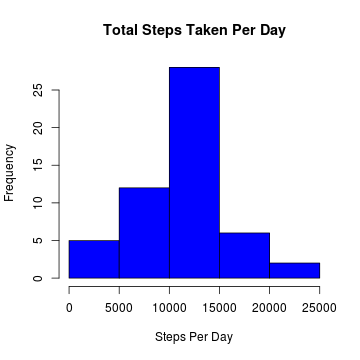
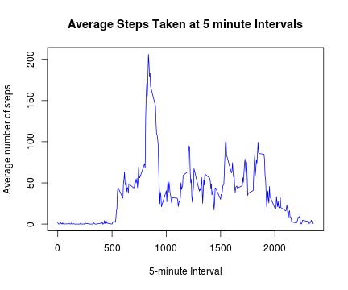
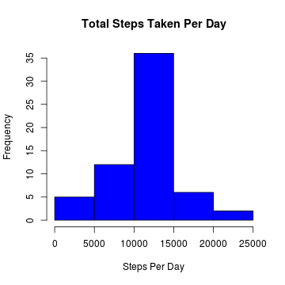
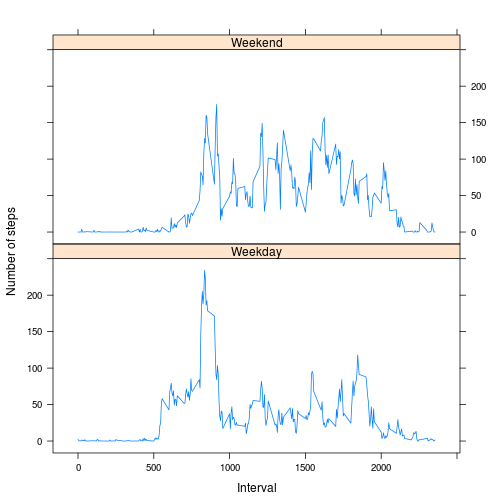

# Reproducible Research: Peer Assessment 1

--------------------------------------------------------------------------------

## Introduction
This assignment makes use of data from a personal activity monitoring device. This device collects data at 5 minute intervals through out the day. The data consists of two months of data from an anonymous individual collected during the months of October and November, 2012 and include the number of steps taken in 5 minute intervals each day.

## Loading and preprocessing the data
1. Load the data
    
    ```r
    df <- read.csv("activity.csv", header = TRUE, na.strings = "NA")
    head(df)
    ```
    
    ```
    ##   steps       date interval
    ## 1    NA 2012-10-01        0
    ## 2    NA 2012-10-01        5
    ## 3    NA 2012-10-01       10
    ## 4    NA 2012-10-01       15
    ## 5    NA 2012-10-01       20
    ## 6    NA 2012-10-01       25
    ```

2. Process/transform the data
    
    ```r
    df$date <- as.Date(df$date, "%Y-%m-%d")
    str(df)
    ```
    
    ```
    ## 'data.frame':	17568 obs. of  3 variables:
    ##  $ steps   : int  NA NA NA NA NA NA NA NA NA NA ...
    ##  $ date    : Date, format: "2012-10-01" "2012-10-01" ...
    ##  $ interval: int  0 5 10 15 20 25 30 35 40 45 ...
    ```

## What is mean total number of steps taken per day?
1. Calculate the total number of steps taken per day
    
    ```r
    steps_per_day <- aggregate(steps ~ date, df, sum)
    ```

2. Make a histogram of the total number of steps taken each day
    
    ```r
    hist(steps_per_day$steps,
         col = "blue",
         main = "Total Steps Taken Per Day",
         xlab = "Steps Per Day")
    ```
    
     

3. Calculate and report the mean and median of the total number of steps taken per day
    
    ```r
    mean(steps_per_day$steps, na.rm = TRUE)
    ```
    
    ```
    ## [1] 10766.19
    ```
    
    ```r
    median(steps_per_day$steps, na.rm = TRUE)
    ```
    
    ```
    ## [1] 10765
    ```

## What is the average daily activity pattern?
1. Make a time series plot (i.e. type = "l") of the 5-minute interval (x-axis) and the average number of steps taken, averaged across all days (y-axis)
    
    ```r
    avg_steps_per_interval <- aggregate(steps ~ interval, df, mean)
    head(avg_steps_per_interval)
    ```
    
    ```
    ##   interval     steps
    ## 1        0 1.7169811
    ## 2        5 0.3396226
    ## 3       10 0.1320755
    ## 4       15 0.1509434
    ## 5       20 0.0754717
    ## 6       25 2.0943396
    ```
    
    ```r
    plot(avg_steps_per_interval$interval, avg_steps_per_interval$steps,
         type = "l",         
         col = "blue",
         main = "Average Steps Taken at 5 minute Intervals",
         xlab = "5-minute Interval", 
         ylab = "Average number of steps")
    ```
    
     

2. Which 5-minute interval, on average across all the days in the dataset, contains the maximum number of steps?
    
    ```r
    avg_steps_per_interval[which.max(avg_steps_per_interval$steps),]
    ```
    
    ```
    ##     interval    steps
    ## 104      835 206.1698
    ```

## Imputing missing values
1. Calculate and report the total number of missing values in the dataset.
    
    ```r
    sum(is.na(df$steps))
    ```
    
    ```
    ## [1] 2304
    ```

2. Devise a strategy for filling in all of the missing values in the dataset.
    
    For simplicity we can fill in all missing values with mean for that 5-minute interval

3. Create a new dataset that is equal to the original dataset but with the missing data filled in.
    
    ```r
    na_indices <- which(is.na(df$steps))
    imputed_values <- avg_steps_per_interval[avg_steps_per_interval$interval == df[na_indices,3],]
    imputed_values <- na.omit(imputed_values)
    df$steps.fixed <- df$steps
    for (i in na_indices) {
        interval <- df$interval[i]
        interval_index <- which(imputed_values$interval == interval)
        df$steps.fixed[i] = imputed_values$steps[interval_index]
    }    
    ```

4. Make a histogram of the total number of steps taken each day
    
    ```r
    steps_per_day_fixed <- aggregate(steps.fixed ~ date, df, sum)
    hist(steps_per_day_fixed$steps.fixed,
         col = "blue",
         main = "Total Steps Taken Per Day",
         xlab = "Steps Per Day")
    ```
    
     

    4a. Calculate and report the mean and median total number of steps taken per day.
    
    ```r
    mean(steps_per_day_fixed$steps, na.rm = TRUE)
    ```
    
    ```
    ## [1] 10766.19
    ```
    
    ```r
    median(steps_per_day_fixed$steps, na.rm = TRUE)
    ```
    
    ```
    ## [1] 10766.19
    ```
    
    4b. Do these values differ from the estimates from the first part of the assignment?
    
    Mean value didn't change, because NAs were replaced with averge steps for the given interval.
    
    4c. What is the impact of imputing missing data on the estimates of the total daily number of steps?
    
    Total daily number of steps have increased for a number of days 

## Are there differences in activity patterns between weekdays and weekends?

1. Create a new factor variable in the dataset with two levels – “weekday” and “weekend” indicating whether a given date is a weekday or weekend day.
    
    ```r
    df$day.type <- ifelse(weekdays(df$date) %in% c("Saturday", "Sunday"), "Weekend", "Weekday")
    unique(df$day.type)
    ```
    
    ```
    ## [1] "Weekday" "Weekend"
    ```
    
2. Make a panel plot containing a time series plot (i.e. type = "l") of the 5-minute interval (x-axis) and the average number of steps taken, averaged across all weekday days or weekend days (y-axis).
    
    ```r
    avg_steps_per_interval_by_day_type <- aggregate(steps ~ interval + day.type, df, mean)
    library(lattice)
    xyplot(steps ~ interval | day.type, avg_steps_per_interval_by_day_type, 
           type = "l", layout = c(1, 2), 
           xlab = "Interval", ylab = "Number of steps")
    ```
    
     
